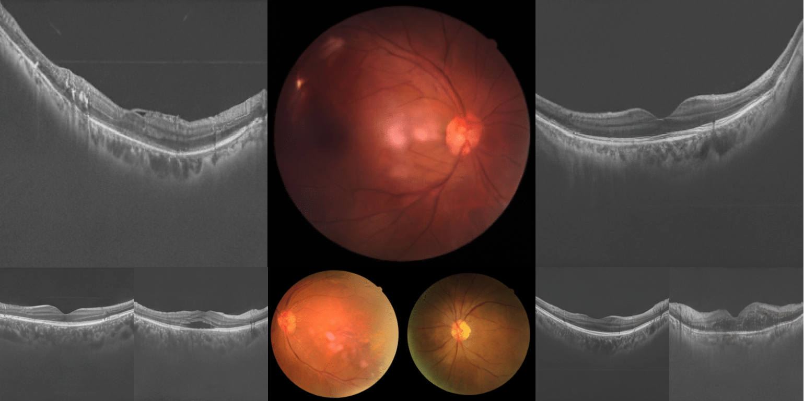

# [An Organism Starts with a Single Pix-Cell: A Neural Cellular Diffusion for High-Resolution Image Synthesis](https://link.springer.com/chapter/10.1007/978-3-031-72378-0_61)

### Authors: [Marawan Elbatel](https://marwankefah.github.io/), [Konstantinos Kamnitsas](https://ibme.ox.ac.uk/person/konstantinos-kamnitsas/), [Xiaomeng Li](https://xmengli.github.io/)

This repository contains the official implementation of the **Generative Cellular Automata (GeCA)** framework. GeCA enables high-resolution image synthesis in medical imaging, specifically designed for data-scarce domains like retinal disease classification from OCT and Fundus images.



## Abstract
Generative modeling seeks to approximate the statistical
properties of real data, enabling synthesis of new data that closely resembles the original distribution. Generative Adversarial Networks (GANs)
and Denoising Diffusion Probabilistic Models (DDPMs) represent significant advancements in generative modeling, drawing inspiration from
game theory and thermodynamics, respectively. Nevertheless, the exploration of generative modeling through the lens of biological evolution
remains largely untapped. In this paper, we introduce a novel family
of models termed Generative Cellular Automata (GeCA), inspired by
the evolution of an organism from a single cell. GeCAs are evaluated as
an effective augmentation tool for retinal disease classification across
two imaging modalities: Fundus and Optical Coherence Tomography
(OCT). In the context of OCT imaging, where data is scarce and the
distribution of classes is inherently skewed, GeCA significantly boosts
the performance of 11 different ophthalmological conditions, achieving
a 12% increase in the average F1 score compared to conventional baselines. GeCAs outperform both diffusion methods that incorporate UNet
or state-of-the art variants with transformer-based denoising models, under similar parameter constraints


## Quantitative Results

### Quantitative Image Quality Evaluation
KID values are expressed as 1e-3. Models are trained and evaluated with classifier-free guidance (CFG) and T = 250.

| Method                        | # Params (↓) | Fundus KID (↓) | Fundus LPIPS (↑) | Fundus GG (>0) | OCT KID (↓) | OCT LPIPS (↑) | OCT GG (>0) |
|-------------------------------|--------------|-----------------|------------------|----------------|-------------|---------------|-------------|
| LDM-B                         | 17.3 M       | 11.64 ± 2.1     | 0.37 ± 0.09      | -10.67        | 64.5 ± 10   | 0.39 ± 0.16   | -2.31       |
| DiT-S                         | 32.7 M       | 12.45 ± 2.8     | 0.31 ± 0.09      | -14.55        | 62.3 ± 5.9  | 0.37 ± 0.14   | -0.44       |
| **GeCA-S (ours)**             | **13.3 M**   | **7.42 ± 1.6**  | **0.39 ± 0.11**  | **2.02**      | **49.1 ± 8.0** | **0.53 ± 0.16** | **0.34**    |

## Getting Started

### Installation
1. Clone the repository:
    ```sh
    git clone https://github.com/xmed-lab/GeCA
    cd GeCA
    ```

2. Create a virtual environment:
    ```sh
    conda create -n GeCA python=3.8
    conda activate GeCA
    ```

3. Install PyTorch:
    ```sh
    pip3 install torch torchvision torchaudio --index-url https://download.pytorch.org/whl/cu118
    ```

4. Install additional dependencies by following the setup in [Fast-DiT](https://github.com/chuanyangjin/fast-DiT):
    ```sh
    pip install -r req.txt
    ```

## Training GeCA

1. **Feature Extraction**:
    ```sh
    CUDA_VISIBLE_DEVICES=0 torchrun --nnodes=1 --master-port 29504 --nproc_per_node=1 extract_features.py --data-path data/oct_multilabel/ --features-path store/oct_features/ --global-batch-size 128 --fold 0
    ```

2. **Model Training**:
    ```sh
    CUDA_VISIBLE_DEVICES=0,1,2,3 accelerate launch --main_process_port 29504 --multi_gpu --num_processes 4 --mixed_precision fp16 train.py --model GeCA-S --feature-path store/oct_features/ --num-classes 11 --global-batch-size 128 --epochs 14000 --fold 8 --validate_every 700 --data-path data/oct_multilabel/ --results-dir ./results_oct_GeCA/
    ```

## Evaluating GeCA
1. Generate synthetic images from the best checkpoint:
    ```sh
    CUDA_VISIBLE_DEVICES=0 torchrun --master-port 29506 --nnodes=1 --nproc_per_node=1 sample_ddp_val.py --expand_ratio 1 --model GeCA-S --data-path oct_multilabel/ --fold 0 --num-sampling-steps 250 --ckpt ./results_oct_GeCA/001-GeCA-S/checkpoints/best_ckpt.pt --sample-dir ./synthetic_oct/
    ```

2. Evaluate generated images:
    ```sh
    python evaluate.py --fold 0 --image-size 256 --device_list cuda:0 --real ./oct_multilabel/ --gen ./synthetic_oct/GeCA-S-GS-fold-0-nstep-250-best_ckpt-size-256-vae-ema-cfg-1.5-seed-0/
    ```


## Expanding Dataset with Synthetic Images
To address data scarcity and class imbalance in OCT datasets, GeCA generates high-quality synthetic images, expanding the dataset five-times. This augmentation enhances model performance by adding diverse training samples while maintaining the original dataset’s class distribution.

```sh
CUDA_VISIBLE_DEVICES=0 torchrun --master-port 29506 --nnodes=1 --nproc_per_node=1 sample_ddp.py --per-proc-batch-size 64 --expand_ratio 5 --model GeCA-S --data-path ./store/oct_features/ --fold 0 --num-sampling-steps 250 --ckpt ./results_oct_GeCA/001-GeCA-S/checkpoints/best_ckpt.pt --sample-dir ./synthetic_oct/
```

### OCT Dataset Classification Performance
 
| Synthetic Data              | Sen. (↑)      | Spe. (↑)      | AUC (↑)        | F1 (↑)         | F1 (sen/spe) (↑) | mAP (↑)       | p-value      |
|-----------------------------|---------------|---------------|----------------|----------------|------------------|---------------|--------------|
| Baseline (Geometric Aug)    | 54.66 ± 1.53 | **96.50 ± 0.16** | 92.47 ± 0.85  | 55.47 ± 0.99  | 60.80 ± 1.49     | 68.85 ± 1.41 | -            |
| Baseline w/o Aug.           | 48.34 ± 1.45 | 96.39 ± 0.20 | 89.99 ± 0.82  | 54.56 ± 1.77  | 50.07 ± 0.89     | 64.58 ± 1.19 | **           |
| LDM-B                       | 58.83 ± 1.90 | 96.12 ± 0.29 | 91.22 ± 0.74  | 59.65 ± 3.19  | 67.74 ± 2.97     | 70.49 ± 2.64 | **           |
| DiT-S                       | 59.25 ± 4.54 | 95.87 ± 0.37 | 91.80 ± 1.74  | 59.11 ± 2.57  | 67.13 ± 4.87     | 69.89 ± 3.34 | ***          |
| **GeCA-S (ours)**           | **59.95 ± 5.32** | 96.38 ± 0.40 | **92.74 ± 2.21** | **61.62 ± 3.93** | **68.38 ± 4.61** | **73.28 ± 5.58** | ****       |

### Acknowledgment
Code is built on [Fast-Dit](https://github.com/chuanyangjin/fast-DiT), [ViTCA](https://openreview.net/forum?id=9t24EBSlZOa), and [DiT](https://github.com/facebookresearch/DiT).

### Citation
```bibtex
@misc{elbatel2024organismstartssinglepixcell,
      title={An Organism Starts with a Single Pix-Cell: A Neural Cellular Diffusion for High-Resolution Image Synthesis}, 
      author={Marawan Elbatel and Konstantinos Kamnitsas and Xiaomeng Li},
      year={2024},
      eprint={2407.03018},
      archivePrefix={arXiv},
      primaryClass={cs.CV},
      url={https://arxiv.org/abs/2407.03018}, 
}
```
